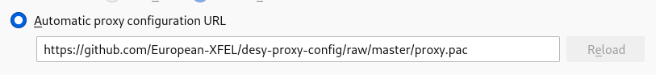

# DESY local proxy config

Some DESY/XFEL internal websites can only be accessed from the internal
network. One way to reach them from outside is to use a local proxy with an
SSH connection, created like this:

```
ssh -D 22222 username@max-display.desy.de
```

The proxy.pac file in this repository tells your browser to use this proxy
for a specific list of sites. It's a specific list so you can leave it in
place when you're not running the ssh proxy. It will only affect sites that
you can't reach without the proxy anyway.

You can use it by configuring this URL in your proxy settings:

https://github.com/European-XFEL/desy-proxy-config/raw/master/proxy.pac

E.g. in Firefox:



You may also be able to clone the repository and use a `file://` URL (tested in
Firefox).
